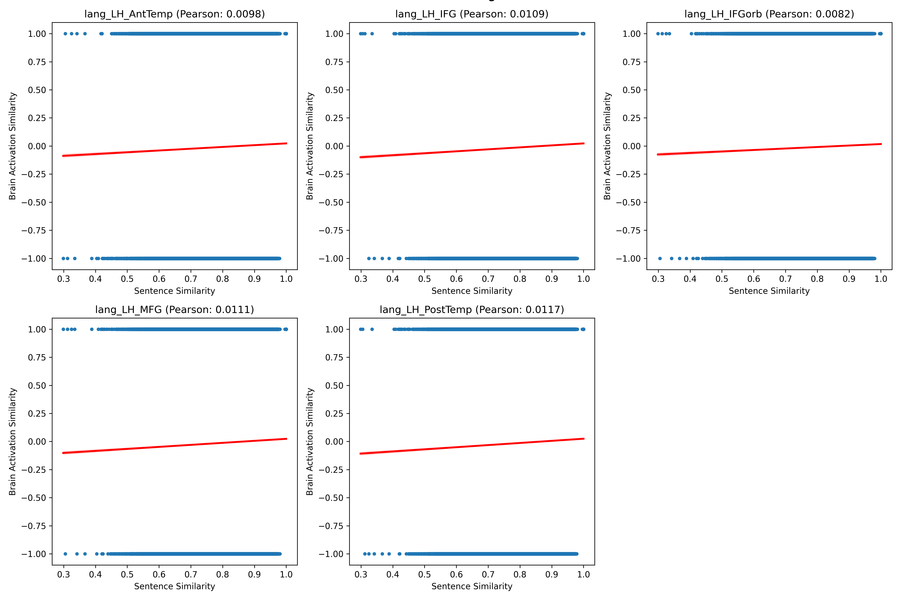

# Brain Alignment Using LLM2Vec and Gradient Boosting Regressor

## Overview
This project focuses on predicting brain activation regions based on sentences, leveraging state-of-the-art language models and regression techniques. The goal is to estimate specific brain activations, represented by numerical values in predefined columns, based on the input sentences.

## Dataset
The dataset contains 1,000 sentences, each associated with six brain activation regions:

- `lang_LH_AntTemp`
- `lang_LH_IFG`
- `lang_LH_IFGorb`
- `lang_LH_MFG`
- `lang_LH_PostTemp`
- `lang_LH_netw`

Each row in the dataset has the following format:

```
item_id,sentence,lang_LH_AntTemp,lang_LH_IFG,lang_LH_IFGorb,lang_LH_MFG,lang_LH_PostTemp,lang_LH_netw
B.1,Taste that fowl and those fish.,0.31203292,0.503357738,0.171333328,0.496015242,0.479702804,0.421033246
```

The dataset was normalized using `StandardScaler` to improve model performance.

## Methodology

### Tools and Libraries
- Hugging Face Transformers: `AutoTokenizer`, `AutoModel`
- LLM2Vec for sentence embeddings
- Scikit-learn for regression (`GradientBoostingRegressor`) and metrics
- PyTorch for GPU acceleration
- NumPy and pandas for data manipulation

### Workflow
1. **Sentence Embedding:**
   Sentences were encoded into numerical vectors using a pre-trained BERT model (`bert-base-cased`) integrated with LLM2Vec. The embeddings were generated with mean pooling.

2. **Normalization:**
   The target columns representing brain activations were normalized using `StandardScaler`.

3. **Modeling:**
   Gradient Boosting Regressor (`GradientBoostingRegressor`) was employed for prediction. The model was trained and evaluated using 5-fold cross-validation.

4. **Metrics:**
   The following metrics were computed for each fold:
   - Mean Squared Error (MSE)
   - Pearson Correlation
   - Accuracy (rounded predictions compared to rounded targets)

5. **Predictions:**
   Predictions for each brain region were stored in a CSV file (`predictions.csv`).

6. **Representational Similarity Analysis (RSA):**
   RSA was conducted to compare the representational similarity between brain activations and sentence embeddings. This was achieved by computing cosine similarities and correlating them for each region.

### Implementation Details
Key sections of the code include:

- **Device Setup:**
  ```python
  device = torch.device("cuda" if torch.cuda.is_available() else "cpu")
  print(f"Using device: {device}")
  ```

- **Tokenizer and Model Initialization:**
  ```python
  model_name = "bert-base-cased"
  tokenizer = AutoTokenizer.from_pretrained(model_name)
  model = AutoModel.from_pretrained(model_name, torch_dtype=torch.float16)
  ```

- **Sentence Embedding Generation:**
  ```python
  llm2vec = LLM2Vec(model=model, tokenizer=tokenizer, pooling_mode="mean")
  sentence_vectors = llm2vec.encode(sentences, convert_to_numpy=True, device=device)
  ```

- **Regression and Cross-Validation:**
  ```python
  gb_model = GradientBoostingRegressor(n_estimators=50)
  for train_index, test_index in KFold(n_splits=5).split(sentence_vectors):
      X_train, X_test = sentence_vectors[train_index], sentence_vectors[test_index]
      y_train, y_test = labels.iloc[train_index], labels.iloc[test_index]
      gb_model.fit(X_train.cpu().numpy(), y_train)
      predictions = gb_model.predict(X_test.cpu().numpy())
  ```

- **Representational Similarity Analysis (RSA):**
  ```python
  sentence_similarity = cosine_similarity(get_encoded_sentences())
  brain_similarity = {}

  for column in params:
      brain_values = data[column].values.reshape(-1, 1)
      brain_similarity[column] = cosine_similarity(brain_values)

  rsa_results = {}
  for column in params:
      sentence_sim_flat = sentence_similarity.flatten()
      brain_sim_flat = brain_similarity[column].flatten()

      rsa_correlation = np.corrcoef(sentence_sim_flat, brain_sim_flat)[0, 1]
      rsa_results[column] = rsa_correlation

  print("Representational Similarity Analysis (RSA) Results:")
  for column, rsa_corr in rsa_results.items():
      print(f"  {column}: {rsa_corr:.4f}")
  ```

### Key Results
- **Metrics Achieved:**
  - Best Mean Squared Error (MSE) for each brain activation column
  - Pearson Correlation values indicating the relationship between predicted and actual values
  - Accuracy scores showing the precision of rounded predictions
  - RSA correlations demonstrating the alignment between brain activations and sentence embeddings

- **Output:**
  The final predictions for each column were saved in `predictions.csv`.

## Key Concepts
- Representational Similarity Analysis (RSA)
- Sentence Embedding Alignment
- Gradient Boosting Regressor for Multivariate Prediction

## Test and Evaluation
Results of the analysis will be documented here, including:
- Quantitative evaluation metrics
- Visual representation of RSA correlations



## Prerequisites
- Python 3.8+
- PyTorch
- Transformers library
- Scikit-learn
- pandas, NumPy

## Acknowledgements
- Hugging Face for the Transformers library
- Scikit-learn for regression tools
- LLM2Vec for facilitating sentence embedding alignment

---
For more details, please refer to the source code in the repository.
